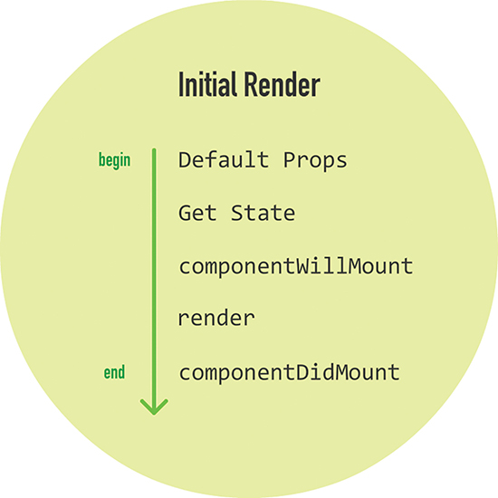
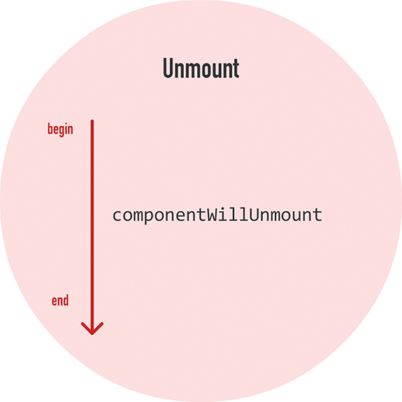

# React Lifecycle Methods
* componentWillMount
* componentDidMount
* componentWillUnmount
* componentWillUpdate
* componentDidUpdate
* shouldComponentUpdate
* componentWillReceiveProps
* componentDidCatch

## There are 4 types of actions that trigger their own subset of the complete set of React component lifecycle methods.

1. Initial Rendering of Component

2. Props Change

3. State Change

4. Unmount Component

